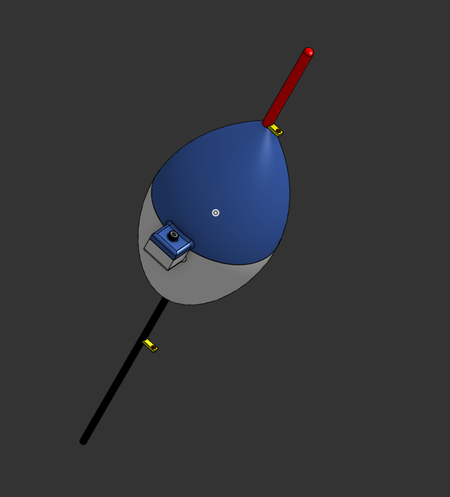
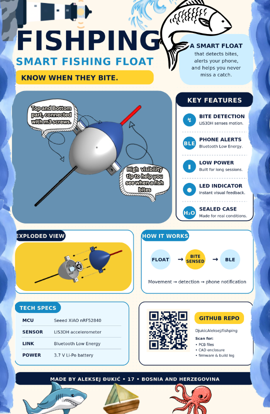
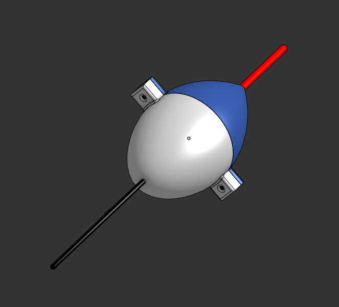
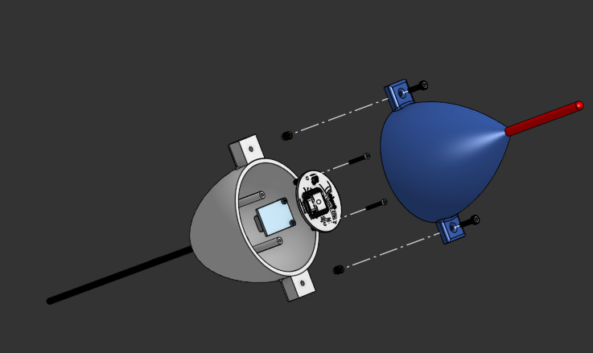
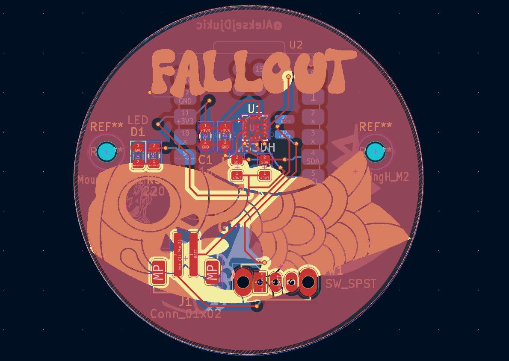
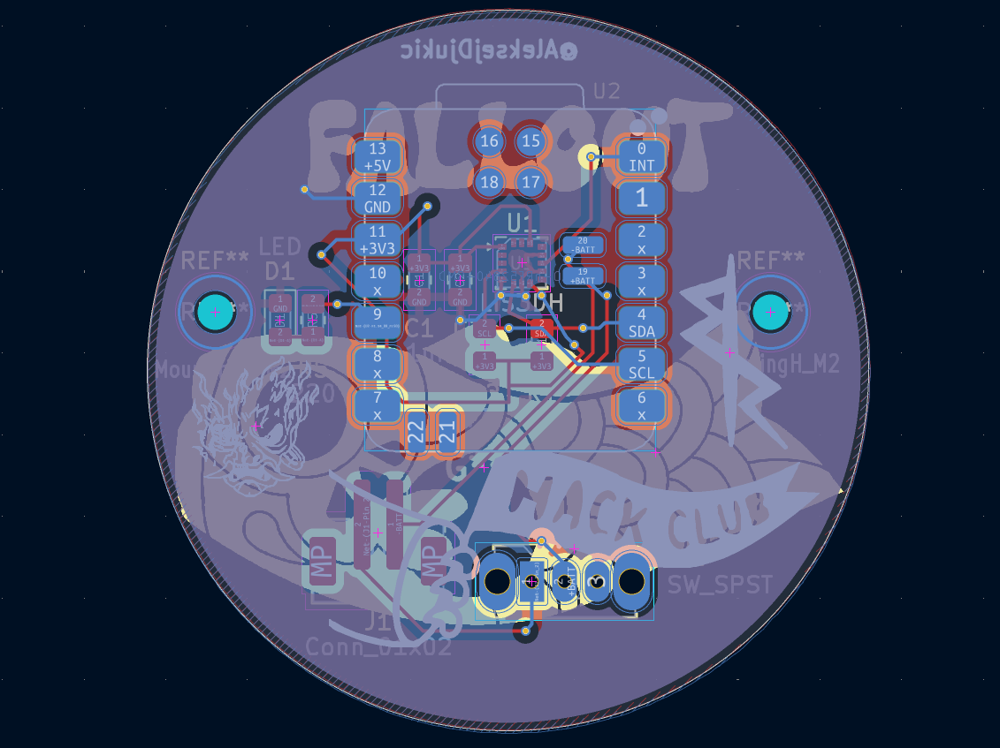
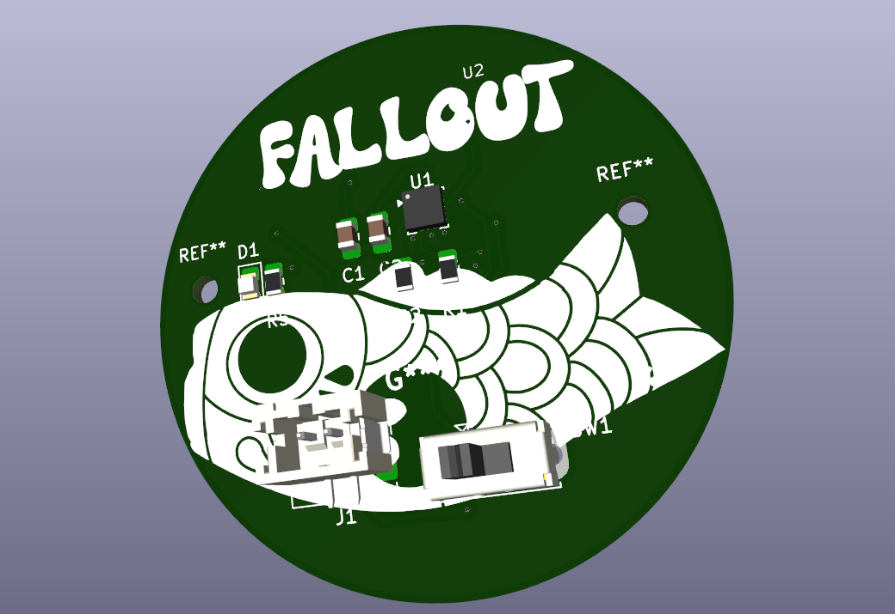
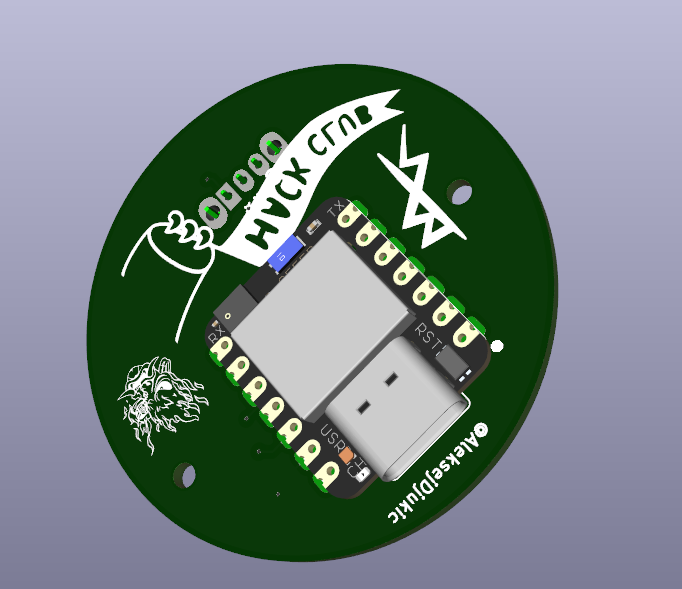
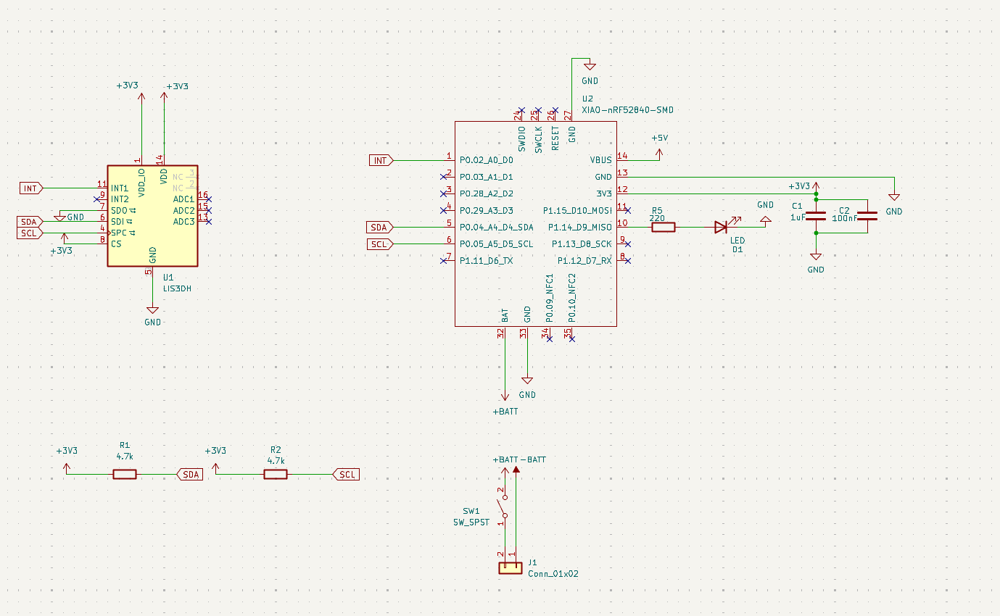

# FishPing



FishPing is a smart fishing float made by me, **Aleksej**, a 17 year old from Bosnia and Herzegovina. It is a custom hardware project with a 3D printed float body, a custom PCB, a Seeed Studio XIAO nRF52840, and a LIS3DH accelerometer that can detect when a fish pulls on the float.

The idea is simple: sometimes when you are fishing you look away for a second, talk to someone, check your phone, or just miss a small bite. FishPing watches the movement of the float and sends a BLE alert to your phone, where a small webpage shows the bite count, the time between bites, battery info, and an alarm.

I wanted this project to be a mix of real outdoor usefulness and hardware learning. It pushed me through PCB design, firmware, BLE, 3D enclosure design, waterproofing considerations, and making a phone interface without needing to write a full Android app.

---

## Zine Design

I also made a magazine style design for the Hack Club Magazine of projects.



---

## Quick Links

- [Firmware](firmware/FishPing_Firmware)
- [Phone web app](firmware/web)
- [PCB files](PCB_Files)
- [3D STEP files](3D_Files)
- [PCB BOM](BOM/BOM.csv)
- [Gerbers](PCB_Files/Gerbers.zip)

---

## Features

- Detects fish pulls using the **LIS3DH 3-axis accelerometer**
- Counts total bites
- Tracks the time since the last bite
- Tracks the interval between bites
- Sends bite events over **Bluetooth Low Energy**
- Android Chrome webpage for connecting to the float
- Phone alarm + vibration when a bite is detected
- Sensitivity and cooldown tuning from the webpage
- Battery-powered PCB with a physical power switch
- 3D printed enclosure with separate battery holder and PCB mounting posts

---

## Case Gallery
Case was designed using Onshape, here is the document link to the OnShape Project. <a href="https://cad.onshape.com/documents/5058fab60298abed43f40cc7/w/999f0f19ac49830b5a18ad7c/e/33939858eac56f5636a0ee71">OnShape Project Link</a>
| Front | Bottom |
| :---: | :---: |
|  |  |

| Exploded View |
| :---: |
|  |

---

## PCB Gallery

| PCB Front | PCB Back |
| :---: | :---: |
|  |  |

| 3D PCB Front | 3D PCB Back |
| :---: | :---: |
|  |  |

### Schematic



---

## How It Works

The float has a **LIS3DH accelerometer** connected to the XIAO nRF52840 over I2C. The firmware samples motion data and looks for sharp changes in acceleration that match the kind of movement a bite creates.

When a bite is detected, the firmware:

1. Increases the bite counter
2. Stores the time of the bite
3. Calculates the interval from the previous bite
4. Blinks the onboard/external status LED
5. Sends a BLE update to the phone

The phone webpage connects over Web Bluetooth, receives those stats, and rings/vibrates when a new bite event comes in.

---

## Repository Contents

| Path | What it contains |
| --- | --- |
| [`firmware/FishPing_Firmware`](firmware/FishPing_Firmware) | Arduino firmware for the XIAO nRF52840 |
| [`firmware/web`](firmware/web) | Android Chrome Web Bluetooth dashboard |
| [`Images`](Images) | Case renders, PCB renders, and schematic image |
| [`PCB_Files`](PCB_Files) | KiCad PCB/schematic files and Gerbers |
| [`3D_Files`](3D_Files) | STEP files for the printed enclosure |
| [`BOM`](BOM) | PCB bill of materials |
| [`tests`](tests) | Optional JavaScript tests for the web app and detector simulator |
| [`tools`](tools) | Bite detector simulator used by the tests |

---

## Build BOM

These are the extra mechanical parts needed for assembling the printed enclosure. This table does not include the PCB components from `BOM/BOM.csv`.

| Item | Quantity | Used for |
| --- | ---: | --- |
| M2 heat-set inserts | 4+ | Battery enclosure and PCB mounting stands |
| M2 x 6mm screws | 2 | Screwing the battery enclosure into the bottom part |
| M2 x 16mm screws | 2 | Screwing the PCB into the long internal stands |
| M3 heat-set inserts | 2 | Connecting the top and bottom float shell |
| M3 x 12mm screws | 2 | Screwing the top part into the bottom part |

Having a few spare inserts is useful because heat-set inserts are easy to overheat or press in slightly crooked.

---

## PCB BOM

This is the main PCB parts BOM from [`BOM/BOM.csv`](BOM/BOM.csv), with the battery added separately. Prices are from the time I exported the BOM, so check them again before ordering because component prices can move around.

| Item | Value | Quantity | LCSC # | Datasheet | Purchase link | Price |
| --- | --- | ---: | --- | --- | --- | ---: |
| Unpolarized capacitor | 1uF | 1 | C141772 | [Datasheet](https://www.lcsc.com/datasheet/C141772.pdf) | [Buy from LCSC](https://www.lcsc.com/product-detail/C141772.html) | $0.49 |
| Unpolarized capacitor | 100nF | 1 | C49678 | [Datasheet](https://www.lcsc.com/datasheet/C49678.pdf) | [Buy from LCSC](https://www.lcsc.com/product-detail/C49678.html) | $0.71 |
| Light emitting diode | LED | 1 | C2297 | [Datasheet](https://www.lcsc.com/datasheet/C2297.pdf) | [Buy from LCSC](https://www.lcsc.com/product-detail/C2297.html) | $0.82 |
| Generic connector, single row, 01x02 | Conn_01x02 | 1 | C160352 | [Datasheet](https://www.lcsc.com/datasheet/C160352.pdf) | [Buy from LCSC](https://www.lcsc.com/product-detail/C160352.html) | $1.72 |
| Resistor | 4.7k | 2 | C17673 | [Datasheet](https://www.lcsc.com/datasheet/C17673.pdf) | [Buy from LCSC](https://www.lcsc.com/product-detail/C17673.html) | $1.29 |
| Resistor | 220 | 1 | C17557 | [Datasheet](https://www.lcsc.com/datasheet/C17557.pdf) | [Buy from LCSC](https://www.lcsc.com/product-detail/C17557.html) | $0.47 |
| Single Pole Single Throw (SPST) switch | SW_SPST | 1 | C431541 | [Datasheet](https://www.lcsc.com/datasheet/C431541.pdf) | [Buy from LCSC](https://www.lcsc.com/product-detail/C431541.html) | $0.58 |
| 3-Axis Accelerometer | LIS3DH | 1 | C15134 | [Datasheet](https://www.st.com/resource/en/datasheet/cd00274221.pdf) | [Buy from LCSC](https://www.lcsc.com/product-detail/C15134.html) | $1.61 |
| Seeed Studio XIAO nRF52840 | XIAO-nRF52840-SMD | 1 | N/A | [Datasheet](https://files.seeedstudio.com/wiki/XIAO-BLE/nRF52840_PS_v1.5.pdf) | [Buy from AliExpress](https://www.aliexpress.com/item/1005006988954136.html) | $12.34 |
| Lithium Ion Polymer Battery | 3.7V 100mAh | 1 | N/A | [Datasheet](https://cdn-shop.adafruit.com/product-files/1570/1570datasheet.pdf) | [Buy from Adafruit](https://www.adafruit.com/product/1570) | $5.95 |
| **Total** |  | **11** |  |  |  | **$25.98** |

---

## Assembly

### 1. Print and prepare the parts

Print the top part, bottom part, and battery enclosure from the files in [`3D_Files`](3D_Files). Clean up any stringing or rough edges around the screw holes before installing inserts.

### 2. Install the battery

Place the battery into its space in the bottom part. After the battery is sitting properly, put the battery enclosure over it so it locks the battery in place.

Install **M2 heat-set inserts** into the marked holes for the battery enclosure, then use **M2 x 6mm screws** to screw the battery enclosure into place.

### 3. Mount the PCB

Install **M2 heat-set inserts** into the long PCB mounting stands. Try to keep the inserts straight, because the PCB holes need to line up cleanly.

Place the PCB into the bottom part so the screw holes align with the stands. Use **M2 x 16mm screws** to lock the PCB down.

### 4. Close the float

Install **M3 heat-set inserts** into the bottom part from the bottom side, in the marked holes used to connect the top and bottom shell.

Place the top part onto the bottom part and use **M3 x 12mm screws** to screw the top shell into the bottom shell.

### 5. Waterproof it

After everything is assembled, add a waterproof coating around the float to make it safer around water. Pay extra attention to seams, screw holes, and any possible gaps around the enclosure.

Do not skip this step. It is still an electronics project sitting in water, so the mechanical seal matters a lot.

---

## Firmware Setup

The firmware is written for the **Seeed Studio XIAO nRF52840** in the Arduino IDE.

### Required Arduino setup

1. Install the Arduino IDE.
2. Open **File > Preferences**.
3. Add this URL to **Additional Boards Manager URLs**:

   ```text
   https://files.seeedstudio.com/arduino/package_seeeduino_boards_index.json
   ```

4. Open **Tools > Board > Boards Manager**.
5. Install the **Seeed nRF52 Boards** package.
6. Open **Library Manager** and install:

   - `ArduinoBLE`

The firmware also uses `Wire`, which is included with Arduino, so you do not need a separate LIS3DH library. The LIS3DH code is included in this repo as `Lis3dhMinimal.h`.

### Uploading

1. Open [`firmware/FishPing_Firmware/FishPing_Float.ino`](firmware/FishPing_Firmware/FishPing_Float.ino).
2. Select the Seeed XIAO nRF52840 board in Arduino IDE.
3. Select the correct USB port.
4. Click **Verify**.
5. Click **Upload**.

If upload fails, double-tap reset on the XIAO to put it into bootloader mode, then upload again.

---

## Phone Web App Setup
The easiest way to use the web page is accessing it using the link - https://fishping.vercel.app/ , I host it on vercel so you can access it for free and use it at your will, if you want to self host it here's how to do it:

The phone side is a simple webpage inside [`firmware/web`](firmware/web). It uses **Web Bluetooth**, so it works best on **Android Chrome**.

No npm packages are required for the actual webpage.

To test it locally on a computer:

```powershell
python -m http.server 8080 -d firmware/web
```

Then open:

```text
http://localhost:8080
```

For Android use, host the `firmware/web` folder somewhere with HTTPS, like GitHub Pages, Netlify, or Cloudflare Pages. Web Bluetooth needs HTTPS on real phones.

---

## How To Use FishPing

1. Charge/connect the battery.
2. Turn on the small switch on the PCB. The board will not consume/use battery power until this switch is on.
3. Open the FishPing webpage on Android Chrome.
4. Tap **Connect**.
5. Select **FishPing Float** from the Bluetooth device list.
6. Tap **Test alarm** once so the browser is allowed to play sound.
7. Put the float in water and use **Calibrate** when it is sitting normally.
8. Start fishing.

If the float triggers too easily from waves, lower the sensitivity or increase cooldown. If it misses small bites, increase sensitivity.

---

## BLE Details

The firmware advertises as:

```text
FishPing Float
```

Main BLE service:

```text
f15bb8d0-7a6f-4f3c-9a91-0fd76a6f1000
```

| Characteristic | UUID suffix | Direction | What it does |
| --- | --- | --- | --- |
| Stats | `1001` | Read / notify | Sends bite count, timing, battery, sensitivity, and sensor status |
| Event | `1002` | Read / notify | Changes whenever a new bite is detected |
| Command | `1003` | Write | Receives commands from the webpage |

Supported commands:

| Command | Meaning |
| --- | --- |
| `RESET` | Clears bite count and timing |
| `ARM` | Enables bite detection |
| `DISARM` | Pauses bite detection |
| `CAL` | Re-learns the normal resting motion baseline |
| `SENS=1..10` | Sets detection sensitivity |
| `COOLDOWN=500..30000` | Sets minimum time between counted bites |

---

## Notes

- The LIS3DH is expected at I2C address `0x18`, but the firmware also checks `0x19`.
- The status LED is on `D9`.
- The LIS3DH interrupt pin is connected to `D0`, but the current firmware detects bites in software from sampled motion data.
- Web Bluetooth does not work in iPhone Safari, which is why this version targets Android Chrome.
- Waterproofing is part of the build, not just decoration. Coat and test carefully before trusting it in water.

---

Built by **Aleksej Djukic**.
